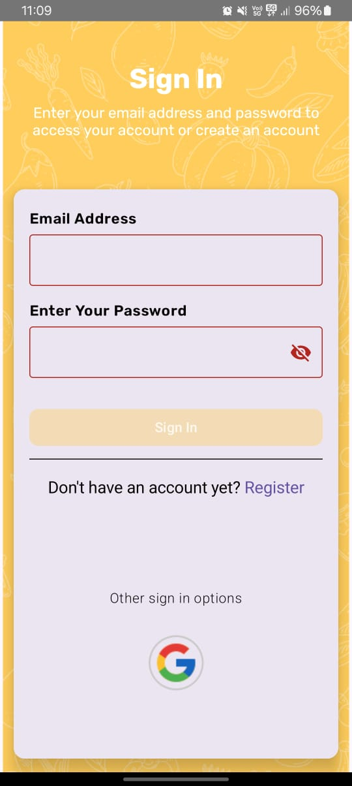
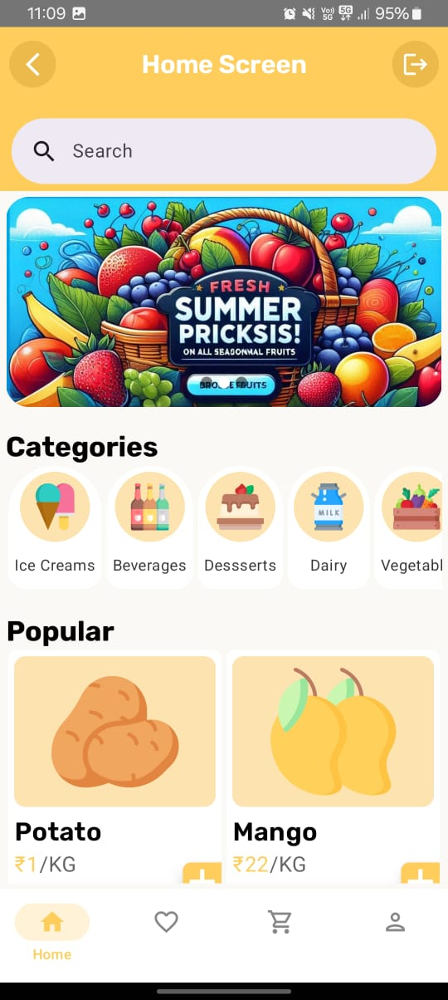
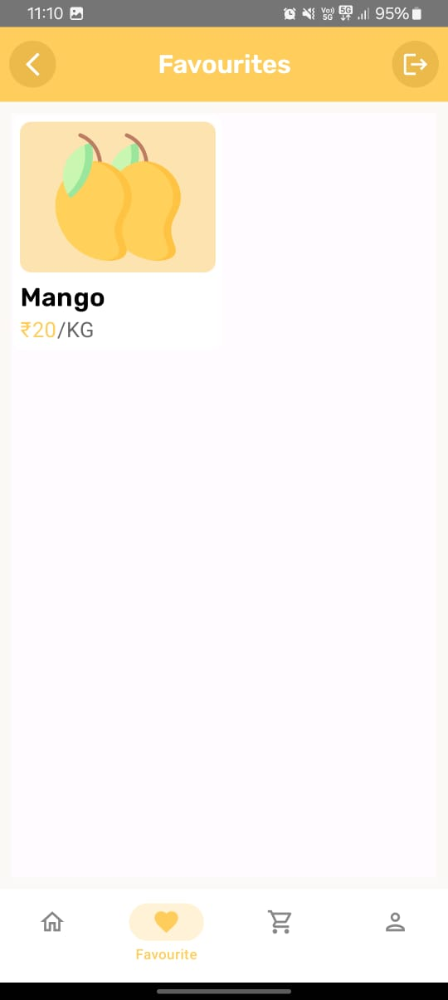
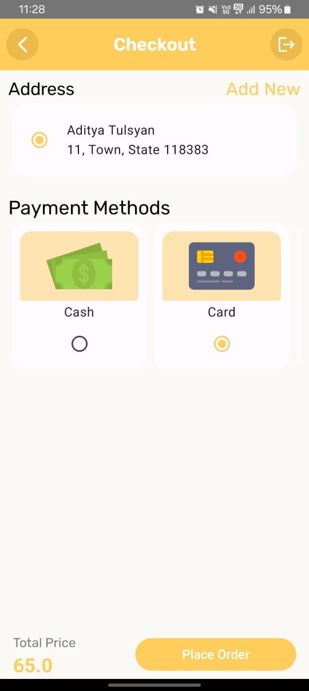

# 🚀 DASHDROP – E-Commerce Android App

*DASHDROP* is a modern Android e-commerce application that allows users to browse products, manage favorites, add items to cart, and place orders — all with a clean UI built using *Jetpack Compose* and a scalable backend powered by *Firebase* and *Firestore*.

---

## 🧩 Features

- 🔐 *User Authentication*
  - Email/Password Login
  - Google Sign-In via Firebase Auth

- 🏠 *Home Screen*
  - Product categories, search, and promotional banners
  - Dynamic product listing (Popular section, Fresh Picks, etc.)

- ❤ *Favourites Screen*
  - Save and manage favorite items
  - Quick access to liked products

- 🛒 *Cart & Promo Codes*
  - Add/remove items with quantity controls
  - Apply promo codes for discounts

- ✅ *Checkout*
  - Address selection or addition
  - Payment method selection (COD / Card placeholder)
  - Order summary and placement

---

## 🛠 Tech Stack

| Layer           | Technology                        |
|----------------|------------------------------------|
| UI             | Jetpack Compose                    |
| Language       | Kotlin                             |
| Backend/Auth   | Firebase Authentication            |
| Database       | Cloud Firestore                    |
| Dependency Mgmt| Gradle                             |
| Architecture   | MVVM (Model-View-ViewModel)        |

---

## 🔐 Firebase Setup

Before running the app, make sure you’ve set up Firebase:

1. Go to [Firebase Console](https://console.firebase.google.com/)
2. Create a new project named DASHDROP
3. Enable *Authentication*:
   - Go to *Authentication > Sign-in method*
   - Enable *Email/Password*
   - (Optional) Enable *Google Sign-In*
4. Enable *Cloud Firestore*
5. Download the google-services.json file and place it inside your Android Studio project at:  
   app/ directory
6. Sync your Gradle and run the app

---

## 🧪 Testing the App

> ⚠ There are *no pre-configured test users* included. Please register a new account via the app's registration screen to test.

You can use any valid email address and password.

*Example (User Created via App):*

Email: testuser@example.com
Password: test1234

You can also test Google Sign-In if it is enabled and properly configured in your Firebase project and app.

---

## 📸 Screenshots

| Sign In           | Home Screen       | Favourites         | Cart               | Checkout          |
|------------------|------------------|-------------------|--------------------|-------------------|
|  |  |  |  |  |

---

## 🧱 Future Improvements

- 🔄 Real-time order tracking  
- 💳 Payment gateway integration  
- 📦 Order history & repeat order  
- 📊 Admin dashboard for managing inventory

---

## 💻 Getting Started

bash
git clone https://github.com/your-username/DASHDROP.git
cd DASHDROP

Then open in Android Studio, connect your Firebase project, and run on emulator or device.

---

🙌 Contribution
Contributions are welcome! Please open an issue first to discuss what you would like to change.

---

🔗 Connect
Built with ❤ by *kumarwhocodes, adityatulsyan03 and kshitijraj-06*

---

Let me know if you'd like this saved as a file or need help generating assets or backend Firestore structure.
